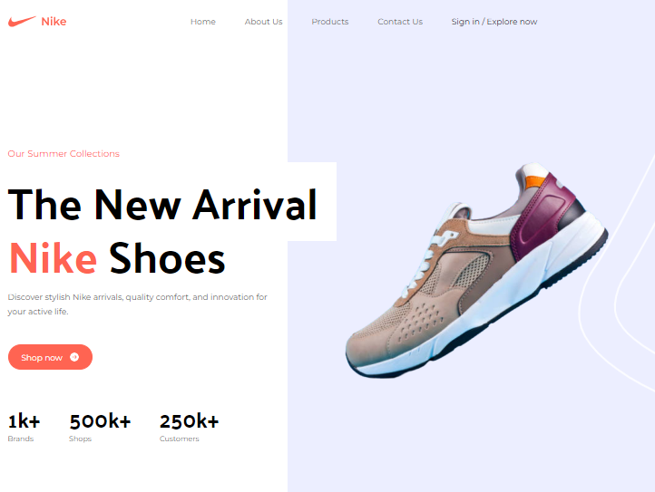
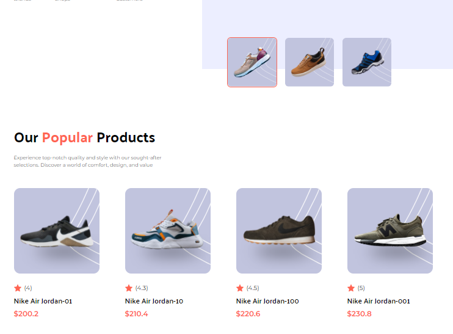

# Nike Landing Page Project - Tailwind CSS &amp; React JS 🏃‍♂️👟
🚀 Nike Landing Page Project  

## Overview

Welcome to the **Nike Landing Page Project**! This project is built with Tailwind CSS and React JS to create a responsive, dynamic, and visually stunning landing page for Nike. The goal is to learn and apply modern web development practices using these powerful tools.

## Features

- **Responsive Design:** Optimized for all devices, ensuring a seamless user experience on mobile, tablet, and desktop.
- **Interactive Elements:** Smooth transitions, hover effects, and engaging UI components.
- **Modern UI/UX:** Clean and minimalist design inspired by Nike's brand aesthetics.

## Tech Stack

- **Tailwind CSS:** For utility-first CSS styling, enabling rapid and consistent design.
- **React JS:** For building interactive and reusable UI components.

## Live Demo

Check out the live demo of the project [here](https://edan-landing-nike.netlify.app/).

## Usage
Customize the content and styles as per your needs. This project serves as a foundation for creating modern and responsive landing pages using Tailwind CSS and React JS.

## Contributing
Contributions are welcome! Feel free to open an issue or submit a pull request.

## License
This project is licensed under the MIT License. See the LICENSE file for more details.

## Acknowledgments
Tailwind CSS Documentation
React JS Documentation
Inspiration from various Nike landing pages and youtube videos.

## Contact
For any questions or feedback, please reach out to euricodande12@gmail.com.

